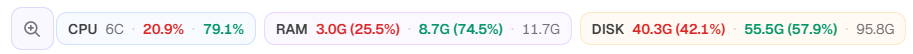
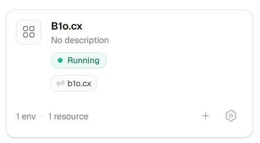
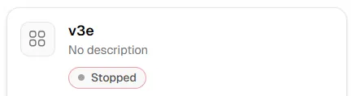
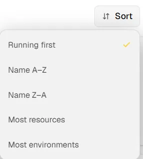
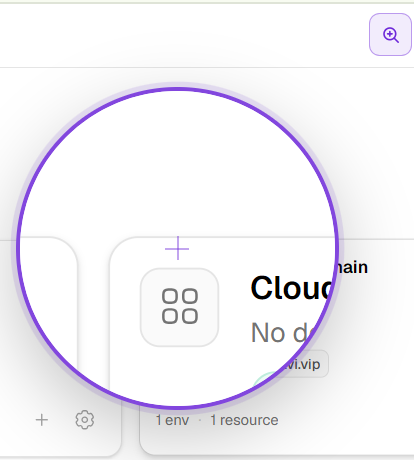

<p align="center">
  
</p>

<p align="center">
  <a href="https://github.com/coollabsio/coolify"></a>
  <a href="https://github.com/AAA-It-uae/coolify-community-enhancements/actions"></a>
  <a href="LICENSE"></a>
</p>

<p align="center"><strong>Practical, tested enhancements for self-hosted Coolify installations.</strong></p>
<p align="center">Operational visibility · faster navigation · project awareness · safer performance tuning</p>
<p align="center">Maintained by <a href="https://github.com/mtalavi">@mtalavi</a></p>

<p align="center">
  <a href="#-what-this-adds">Features</a> ·
  <a href="#-visual-preview">Screenshots</a> ·
  <a href="#-enhancements">Enhancements</a> ·
  <a href="#-safety--compatibility">Safety</a> ·
  <a href="#-upstream--community">Upstream</a>
</p>

> [!IMPORTANT]
> These are community-maintained modifications, not official Coolify features. They are version-specific and may be replaced by future Coolify updates. Installers use prechecks, timestamped backups, validation and rollback rather than forcing a patch onto an unknown source layout.

## ✨ What this adds

<table>
<tr>
<td width="33%"><b>🖥️ Live server vitals</b><br>CPU used/free, RAM used/available/total, disk used/free/total and server load directly in the top bar.</td>
<td width="33%"><b>● Project awareness</b><br><code>Running</code>, <code>Starting</code>, <code>Unhealthy</code>, <code>Stopped</code> and <code>Empty</code> on project cards.</td>
<td width="33%"><b>↕ Running first</b><br>Surface operational projects first while keeping the existing sort choices.</td>
</tr>
<tr>
<td><b>🔗 Clickable domains</b><br>Active domains shown directly on cards and ready to open.</td>
<td><b>🔍 Interface magnifier</b><br>A compact movable zoom lens for inspecting dense dashboard areas.</td>
<td><b>⚡ Performance tuning</b><br>Short-lived status caching and less aggressive background polling.</td>
</tr>
</table>

## 🖼️ Visual preview

### Live CPU, RAM and disk vitals

<p align="center">
  
</p>

<p align="center"><sub>See used/free CPU, RAM and disk capacity directly in the top bar. Host vitals refresh every 15 seconds.</sub></p>

<table>
<tr>
<td width="50%" align="center">
  <br>
  <b>Running project + active domain</b><br>
  <sub>Status and clickable domain are visible directly on the card.</sub>
</td>
<td width="50%" align="center">
  <br>
  <b>Stopped state at a glance</b><br>
  <sub>No need to open the project just to check its current state.</sub>
</td>
</tr>
<tr>
<td align="center">
  <br>
  <b>Running-first sorting</b><br>
  <sub>Keep operational projects at the top.</sub>
</td>
<td align="center">
  <br>
  <b>Interactive magnifier</b><br>
  <sub>Inspect UI details without changing browser zoom.</sub>
</td>
</tr>
</table>

## 🧩 Enhancements

### 1. Dashboard Observability

Adds live operational information directly to Coolify:

- CPU core count with used and free percentage
- RAM used, available and total capacity with percentages
- root filesystem disk used, free and total capacity with percentages
- Linux server load averages for 1 / 5 / 15 minutes
- responsive top-bar layout with progressive disclosure on narrower screens
- project-level status aggregation
- Livewire host-vitals refresh every 15 seconds without a custom telemetry HTTP endpoint

**Explore:** [`dashboard-observability/`](dashboard-observability/)

### 2. Project Dashboard Plus

Makes the Projects view more useful during daily operations:

- `Running first` sorting with persisted preference
- `Running`, `Starting`, `Unhealthy`, `Stopped` and `Empty` states
- clickable active domains on cards
- domain-aware project search
- improved table/grid usability

**Explore:** [`project-dashboard-plus/`](project-dashboard-plus/)

### 3. Interactive Magnifier

Adds a compact interface inspection tool:

- toolbar magnifier button
- large circular zoom lens
- inspect any visible dashboard area without browser-level zoom
- desktop-focused responsive visibility

**Explore:** [`interactive-magnifier/`](interactive-magnifier/)

### 4. Dashboard Performance Tuning

Reduces avoidable background work:

- short-lived cache for aggregate project status
- host-vitals polling reduced to a 15-second interval
- deployment indicator polling reduced from the original aggressive interval
- active-deployments polling reduced from the original aggressive interval

On one real Coolify 4.3.10 installation with 22 projects, measured median component times changed as follows after cache prewarming:

| Path | Before | After |
| --- | ---: | ---: |
| Dashboard mount | 182.67 ms | 18.85 ms |
| Projects mount | 227.31 ms | 22.77 ms |
| Project status aggregation | 315.76 ms | 4.10 ms |

> These figures are evidence from one tested installation, not a universal benchmark.

**Explore:** [`dashboard-performance/`](dashboard-performance/)

## 🛡️ Safety & compatibility

The installation approach is deliberately defensive:

1. verify the Coolify container and expected source files
2. verify the tested Coolify image/version where required
3. create a timestamped backup
4. modify temporary copies first
5. validate PHP / Blade / expected source anchors
6. clear and rebuild framework caches
7. restart only the Coolify application container when required
8. wait for a healthy state
9. rollback automatically when an operation fails

### Tested environment

- Coolify `4.3.10`
- standard Docker-based Coolify installation
- healthy Coolify application, database, Redis, realtime, sentinel and proxy containers
- disk metrics validated against the host root-filesystem view before and after restart

> [!CAUTION]
> Do not assume compatibility with newer Coolify releases. If upstream source layouts change, adapt the implementation to the new version instead of forcing an older patch.

## 📁 Repository structure

```text
coolify-community-enhancements/
├── dashboard-observability/
├── project-dashboard-plus/
├── interactive-magnifier/
├── dashboard-performance/
├── assets/
│   ├── hero/
│   └── screenshots/
├── docs/
└── .github/workflows/
```

Each logical enhancement gets its own directory. A separate repository only makes sense when an enhancement becomes a standalone product with its own lifecycle, releases or users outside Coolify.

## 💬 Upstream & community

These external modifications are working proofs of concept. They demonstrate the idea and measured behavior; they are not presented as the exact architecture Coolify must merge unchanged.

**Preferred contribution path:**

`working implementation → evidence → focused discussion → maintainer feedback → native upstream implementation / PR`

Current upstream discussions:

- [Operational dashboard / UI proposal #11483](https://github.com/coollabsio/coolify/discussions/11483)
- [Dashboard performance proposal #11484](https://github.com/coollabsio/coolify/discussions/11484)
- [Coolify v4.3 UI feedback thread #11195](https://github.com/coollabsio/coolify/discussions/11195)

See also [`docs/upstream-proposal.md`](docs/upstream-proposal.md).

## Contributing

Focused reports and improvements are welcome. Please include the Coolify version, what changed, how it was tested, before/after behavior and logs with credentials/private hostnames removed.

Security-sensitive reports should follow [`SECURITY.md`](SECURITY.md).

## License

MIT. See [`LICENSE`](LICENSE).
