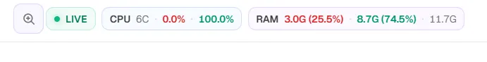

# Coolify Community Enhancements

Practical, tested enhancements for self-hosted Coolify installations, focused on **operational visibility, faster navigation, project status awareness and dashboard performance**.

Maintained by [@mtalavi](https://github.com/mtalavi).

> [!IMPORTANT]
> These are community-maintained modifications, not official Coolify features. They are version-specific and may be replaced by a future Coolify update. Installers use prechecks, timestamped backups, validation and rollback rather than forcing a patch onto an unknown source layout.

## What this adds

| Area | Enhancement |
| --- | --- |
| Server visibility | Live CPU usage, core count, RAM usage/capacity and server load in the Coolify top bar |
| Project awareness | `Running`, `Starting`, `Unhealthy`, `Stopped` and `Empty` status directly on project cards |
| Project navigation | Clickable active domains directly on project cards |
| Prioritization | `Running first` sorting with persisted preference |
| UI inspection | Interactive magnifier for quickly zooming any part of the Coolify interface |
| Performance | Short-lived status caching and reduced unnecessary background polling |

## Visual preview

### Live server vitals

<p align="center">
  
</p>

The top bar exposes the server state without leaving the page: CPU cores and usage, free/used CPU view, RAM usage/capacity and live status.

### Interactive magnifier

<p align="center">
  
</p>

A compact magnifier button opens a movable zoom lens. Click or move over the interface to inspect dense dashboard areas without changing browser zoom.

### Running-first project sorting

<p align="center">
  
</p>

Operational projects can be surfaced first while keeping the existing name/resource/environment sorting choices.

### Project status and clickable domains

<table>
<tr>
<td width="50%" align="center"></td>
<td width="50%" align="center"></td>
</tr>
<tr>
<td><b>Running</b> state plus the active domain directly on the card. Domain chips are clickable.</td>
<td><b>Stopped</b> state is visible at a glance without opening the project.</td>
</tr>
</table>

## Enhancements

### 1. Dashboard Observability

Adds live operational information directly to Coolify:

- live CPU usage and core count
- live RAM usage and capacity
- server load
- project-level status aggregation
- Livewire-based refresh without a custom telemetry HTTP endpoint

See [`dashboard-observability/`](dashboard-observability/).

### 2. Project Dashboard Plus

Makes the Projects view more useful during daily operations:

- `Running first` sorting
- persisted sort preference
- `Running`, `Starting`, `Unhealthy`, `Stopped` and `Empty` status
- clickable active domains on cards
- domain-aware project search
- improved table/grid usability

See [`project-dashboard-plus/`](project-dashboard-plus/).

### 3. Interactive Magnifier

Adds a compact interface inspection tool:

- toolbar magnifier button
- large circular zoom lens
- inspect any visible dashboard area without browser-level zoom
- desktop-focused responsive visibility

See [`interactive-magnifier/`](interactive-magnifier/).

### 4. Dashboard Performance Tuning

Reduces avoidable background work:

- short-lived cache for aggregate project status
- server-vitals polling from 2s to 5s
- deployment indicator polling from 3s to 10s
- active-deployments polling from 3s to 10s

On one real Coolify 4.3.10 installation with 22 projects, measured median component times changed as follows after cache prewarming:

| Path | Before | After |
| --- | ---: | ---: |
| Dashboard mount | 182.67 ms | 18.85 ms |
| Projects mount | 227.31 ms | 22.77 ms |
| Project status aggregation | 315.76 ms | 4.10 ms |

These figures are evidence from one tested installation, not a universal benchmark.

See [`dashboard-performance/`](dashboard-performance/).

## Tested environment

The initial implementation was validated on:

- Coolify `4.3.10`
- standard Docker-based Coolify installation
- healthy Coolify application, database, Redis, realtime, sentinel and proxy containers

## Safety model

The installation approach is intentionally defensive:

1. verify the Coolify container and expected source files
2. verify the tested Coolify image/version where required
3. create a timestamped backup
4. modify temporary copies first
5. validate PHP / Blade / expected source anchors
6. clear and rebuild framework caches
7. restart only the Coolify application container when required
8. wait for a healthy state
9. rollback automatically when an operation fails

## Repository structure

```text
coolify-community-enhancements/
├── dashboard-observability/
├── project-dashboard-plus/
├── interactive-magnifier/
├── dashboard-performance/
├── assets/
│   └── screenshots/
├── docs/
└── .github/workflows/
```

Each logical enhancement gets its own directory. A separate repository is only warranted when an enhancement becomes a standalone product with its own lifecycle, releases or users outside Coolify.

## Upstream direction

These external modifications are working proofs of concept. They are not presented as the architecture that Coolify must merge unchanged.

For enhancements that fit the product direction, the preferred path is:

**working implementation → evidence → focused community discussion → maintainer feedback → native upstream implementation / PR**

See [`docs/upstream-proposal.md`](docs/upstream-proposal.md).

## Compatibility

Do not assume compatibility with newer Coolify releases. If Coolify changes the relevant Blade, Livewire, model or support files, adapt the implementation to the new upstream source rather than forcing an old patch.

## Contributing

Focused reports and improvements are welcome. Please include the Coolify version, what changed, how it was tested, before/after behavior and logs with credentials/private hostnames removed.

## License

MIT. See [`LICENSE`](LICENSE).
