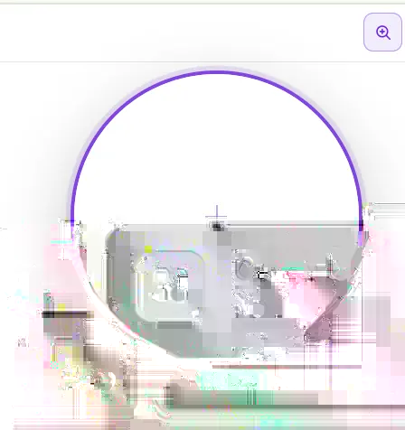

# Interactive Magnifier

A lightweight inspection tool for dense Coolify interfaces.

## Features

- Compact magnifier button in the top toolbar.
- Large circular zoom lens over the current interface.
- Inspect cards, labels, controls and status information without changing browser zoom.
- Click-through interaction design so the tool stays out of the normal workflow when inactive.
- Desktop-focused responsive visibility.

## Screenshot

## Why

Operational dashboards often compress a lot of information into a small area. Browser-level zoom changes the entire layout and can make the page harder to use. A local magnifier allows temporary inspection of one area while preserving the surrounding dashboard context.

## Implementation notes

The tested implementation adds the magnifier to the Coolify top bar and keeps the control visually compact when not in use. The external prototype includes backup and validation before modifying the running Coolify view.

For upstream work, the preferred approach is a native implementation aligned with the current Coolify UI components and accessibility conventions.

## Compatibility

Initial prototype tested on Coolify `4.3.10`. Treat this as version-specific until validated against later releases.
